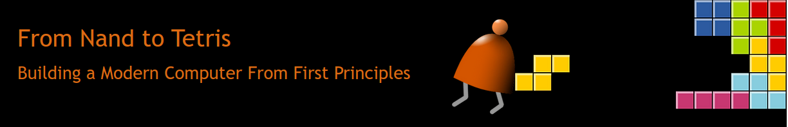

# Nand2Tetris

[The Elements of Computing Systems](https://www.nand2tetris.org/book), By [Noam Nisan](https://www.cs.huji.ac.il/~noam/) and [Shimon Schocken](https://www.shimonschocken.com/) (MIT Press)

## All projects from Nand2Tetris

- [x] [Project 1: Boolean Logic](https://gitlab.com/0xbaruas/nand2tetris/-/tree/main/projects/01)
- [ ] [Project 2: Boolean Arithmetic](#)
- [ ] [Project 3: Sequential Logic](#) 
- [ ] [Project 4: Machine Language](#) 
- [ ] [Project 5: Computer Architecture](#) 
- [ ] [Project 6: Assembler](#)
- [ ] [Project 7: VM I: Stack Arithmetic ](#)  
- [ ] [Project 8: VM II: Program Control](#)   
- [ ] [Project 9: High-Level Language](#) 
- [ ] [Project 10: Compiler I: Syntax Analysis](#)   
- [ ] [Project 11: Compiler II: Code Generation](#)   
- [ ] [Project 12: Operating System](#) 
