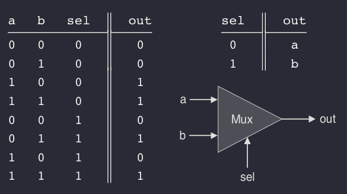
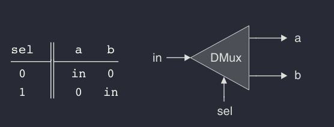
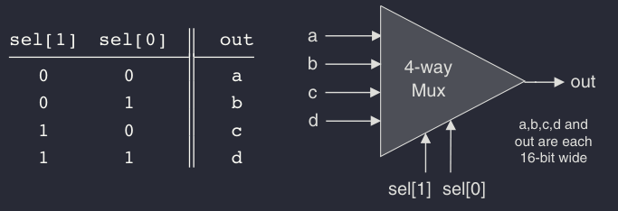
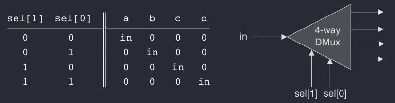

# Project 1: Introduction to Logic Gates

The goal of this project is to implement primitive logic gates using Nand gates and other composite gates using primitive gates in HDL (Hardware Description Language).


<br>
<br>

### NOT gate
---
The single-input Not gate, also known as ‘‘converter,’’ converts its input from 0 to 1 and vice versa. The gate API is as follows:
```
Chip name: Not
Inputs: in
Outputs: out
Function: If in=0 then out=1 else out=0.
```

<br>
<br>

### AND gate
---
The And function returns 1 when both its inputs are 1, and 0 otherwise.

```
Chip name: And
Inputs: a, b
Outputs: out
Function: If a=b=1 then out=1 else out=0.
```


<br>
<br>

### Or
---
The Or function returns 1 when at least one of its inputs is 1, and 0 otherwise.
```
Chip name: Or
Inputs: a, b
Outputs: out
Function: If a=b=0 then out=0 else out=1.
```

<br>
<br>

### Xor
---
The Xor function, also known as ‘‘exclusive or,’’ returns 1 when its two inputs have opposing values, and 0 otherwise.
```
Chip name: Xor
Inputs: a, b
Outputs: out
Function: If a=/b then out=1 else out=0.
```


<br>
<br>

### Multiplexor
---
A multiplexor is a three-input gate that uses one of the inputs, called ‘‘selection bit,’’ to select and output one of the other two inputs, called ‘‘data bits.’’ Thus, a better name for this device might have been selector. The name multiplexor was adopted from communications systems, where similar devices are used to serialize (multiplex) several input signals over a single output wire.


```
Chip name: Mux
Inputs: a, b, sel
Outputs: out
Function: If sel=0 then out=a else out=b.
```


<br>
<br>

### Demultiplexor
---
A demultiplexor performs the opposite function of a multiplexor: It takes a single input and channels it to one of two possible outputs according to a selector bit that specifies which output to chose.


```
Chip name: DMux
Inputs: in, sel
Outputs: a, b
Function: If sel=0 then {a=in, b=0} else {a=0, b=in}.
```


<br>
<br>

### Multi-Bit Not
---

An n-bit Not gate applies the Boolean operation Not to every one of the bits in its n-bit input bus:
```
Chip name: Not16
Inputs: in[16] // a 16-bit pin
Outputs: out[16]
Function: For i=0..15 out[i]=Not(in[i]).
```


<br>
<br>

### Multi-Bit And
An n-bit And gate applies the Boolean operation And to every one
of the n bit-pairs arrayed in its two n-bit input buses:
```
Chip name: And16
Inputs: a[16], b[16]
Outputs: out[16]
Function: For i=0..15 out[i]=And(a[i],b[i]).
```

<br>
<br>

### Multi-Bit Or
---
An n-bit Or gate applies the Boolean operation Or to every one of the n bit-pairs arrayed in its two n-bit input buses:
```
Chip name: Or16
Inputs: a[16], b[16]
Outputs: out[16]
Function: For i=0..15 out[i]=Or(a[i],b[i]).
```


<br>
<br>

### Multi-Bit Multiplexor
---
An n-bit multiplexor is exactly the same as the binary multi- plexor described in figure 1.8, except that the two inputs are each n-bit wide; the selector is a single bit.
```
Chip name: Mux16
Inputs: a[16], b[16], sel
Outputs: out[16]
Function:   If sel=0 then for i=0..15 out[i]=a[i]
            else for i=0..15 out[i]=b[i].
```


<br>
<br>

### Multi-Way Or
---
An n-way Or gate outputs 1 when at least one of its n bit inputs is 1,
and 0 otherwise. Here is the 8-way variant of this gate:
```
Chip name: Or8Way
Inputs: in[8]
Outputs: out
Function: out=Or(in[0],in[1],...,in[7]).
```

<br>
<br>

### Multi-Way/Multi-Bit Multiplexor
---
An m-way n-bit multiplexor selects one of m n- bit input buses and outputs it to a single n-bit output bus. The selection is specified by a set of k control bits, where k ¼ log2 m. Figure depicts a typical example.


```Chip name: Mux4Way16
Inputs: a[16], b[16], c[16], d[16], sel[2]
Outputs: out[16]
Function:   If sel=00 then out=a else if sel=01 then out=b
            else if sel=10 then out=c else if sel=11 then out=d
            Comment: The assignment operations mentioned above are all
            16-bit. For example, "out=a" means "for i=0..15
            out[i]=a[i]".
```

```
Chip name: Mux8Way16
Inputs: a[16],b[16],c[16],d[16],e[16],f[16],g[16],h[16], sel[3]
Outputs: out[16]
Function:   If sel=000 then out=a else if sel=001 then out=b
            else if sel=010 out=c ... else if sel=111 then out=h
            Comment: The assignment operations mentioned above are all
            16-bit. For example, "out=a" means "for i=0..15
```


<br>
<br>

### Multi-Way/Multi-Bit Demultiplexor
---

An m-way n-bit demultiplexor channels a single n-bit input into one of m possible n-bit outputs. The selection is specified by a set of k control bits, where k = log2 m.


```
Chip name: DMux4Way
Inputs: in, sel[2]
Outputs: a, b, c, d
Function:   If sel=00 then
            {a=in, b=c=d=0}
            else if sel=01 then {b=in, a=c=d=0}
            else if sel=10 then {c=in, a=b=d=0}
            else if sel=11 then {d=in, a=b=c=0}.
```
```
Chip name: DMux8Way
Inputs: in, sel[3]
Outputs: a, b, c, d, e, f, g, h
Function:   If sel=000 then
            {a=in, b=c=d=e=f=g=h=0}
            else if sel=001 then {b=in, a=c=d=e=f=g=h=0}
            else if sel=010 ...
            ...
            else if sel=111 then {h=in, a=b=c=d=e=f=g=0}.
```