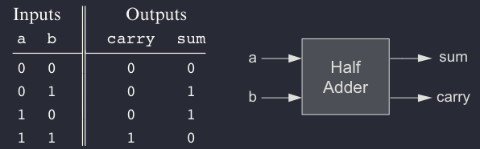
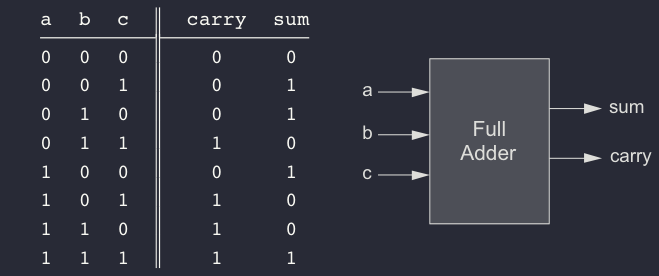
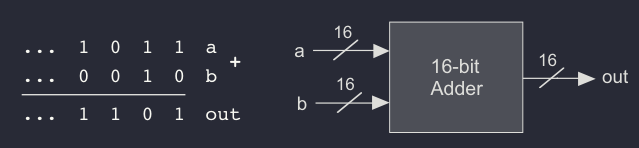
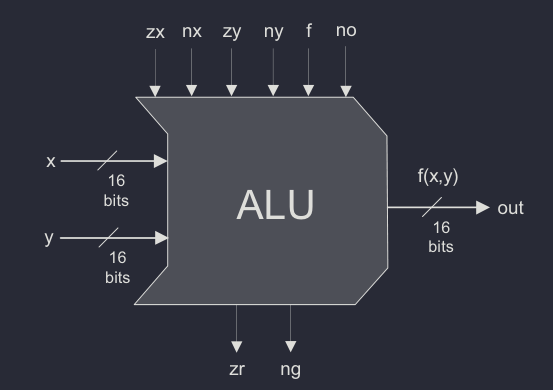

# Project 2:  Boolean Arithmetic

The goal of the project is to create an Arithmetic Logic Unit from scratch.

In order to build our ALU, we first build a `Half Adder` using a `And` and a
`Xor` gate, that takes a and b as an input and yields the sum and the carry
as an output. From there, we can build a `Full Adder` and then a `16-bit Adder`.

Then, based on those chips, whe can build the ALU. It has the following inputs :
* `x` and `y` 16-bits inputs that represent the data on which you want to operate.
* `zx`, `nx`, `zy`, `ny`, `f` and `no` which are the control bits of the ALU
  * `zx` stands for `zero x input`
  * `nx` stands for `not x input`
  * `zy` stands for `zero y input`
  * `ny` stands for `non y input`
  * `f` adds the transformed x and y if f is 1 or perform an And operation otherwise
  * `no` negates the output

It has the following outputs :
* `out` the 16-bits output
* `zr` true if out = 0
* `ng` true if out < 0

Using those 6 control bits wisely, we are able to perform the following operations :

| zx  | nx  | zy  | ny  | f   | no  |out  |
| --- | --- | --- | --- | --- | --- | --- |
| 1   | 0   | 1   | 0   | 1   | 0   | 0   |
| 1   | 1   | 1   | 1   | 1   | 1   | 1   |
| 1   | 1   | 1   | 0   | 1   | 0   | -1  |
| 0   | 0   | 1   | 1   | 0   | 0   | x   |
| 1   | 1   | 0   | 0   | 0   | 0   | y   |
| 0   | 0   | 1   | 1   | 0   | 1   | !x  |
| 1   | 1   | 0   | 0   | 0   | 1   | !y  |
| 0   | 0   | 1   | 1   | 1   | 1   | -x  |
| 1   | 1   | 0   | 0   | 1   | 1   | -y  |
| 0   | 1   | 1   | 1   | 1   | 1   | x+1 |
| 1   | 1   | 0   | 1   | 1   | 1   | y+1 |
| 0   | 0   | 1   | 1   | 1   | 0   | x-1 |
| 1   | 1   | 0   | 1   | 0   | 0   | y-1 |
| 0   | 0   | 0   | 0   | 1   | 0   | x+y |
| 0   | 1   | 0   | 0   | 1   | 1   | x-y |
| 0   | 0   | 0   | 1   | 1   | 1   | y-x |
| 0   | 0   | 0   | 0   | 0   | 0   | x&y |
| 0   | 1   | 0   | 1   | 0   | 1   | x|y |

We finish this project by building an incrementer which performs the simple task
`out = in + 1`.


<br>
<br>
<br>
<br>


## Specification of Components 
---

<br>


### Half-Adder
---

The first step on our way to adding binary numbers is to be able to add two bits. Let us call the least significant bit of the addition sum, and the most significant bit carry. Following figure presents a chip, called half-adder, designed to carry out


```
Chip name:  HalfAdder
Inputs:     a, b
Outputs:    sum, carry
Function:   sum = LSB of a + b
            carry = MSB of a + b
```

<br>
<br>
<br>


### Full-Adder
---
Now that we know how to add two bits, figure 2.3 presents a full-adder chip, designed to add three bits. Like the half-adder case, the full-adder chip produces two outputs: the least significant bit of the addition, and the carry bit.



```
Chip name:  FullAdder
Inputs:     a, b, c
Outputs:    sum, carry
Function:   sum = LSB of a + b + c
            carry = MSB of a + b + c
```


<br>
<br>
<br>


### 16-bit Adder
---
Memory and register chips represent integer numbers by n-bit patterns, n being 16, 32, 64, and so forth—depending on the computer platform. The chip whose job is to add such numbers is called a multi-bit adder, or simply adder. Following figure presents a 16-bit adder, noting that the same logic and specifications scale up as is to any n-bit adder.



```
Chip name:  Add16
Inputs:     a[16], b[16]
Outputs:    out[16]
Function:   out = a + b
Comment:    Integer 2's complement addition.
            Overflow is neither detected nor handled.
```

<br>
<br>
<br>


### Incrementer
---

It is convenient to have a special-purpose chip dedicated to adding the
constant 1 to a given number. Here is the specification of a 16-bit incrementer:

```
Chip name:  Inc16
Inputs:     in[16]
Outputs:    out[16]
Function:   out=in+1
Comment:    Integer 2’s complement addition.
            Overflow is neither detected nor handled.
```


<br>
<br>
<br>


### The Arithmetic Logic Unit (ALU)
---


```
Chip name:  ALU
Inputs:     x[16], y[16],                           // Two 16-bit data inputs
            zx,                                     // Zero the x input
            nx,                                     // Negate the x input
            zy,                                     // Zero the y input
            ny,                                     // Negate the y input
            f,                                      // Function code: 1 for Add, 0 for And
            no                                      // Negate the out output
Outputs:    out[16],                                // 16-bit output
            zr,                                     // True iff out=0
            ng                                      // True iff out<0
Function:   if zx then x = 0                        // 16-bit zero constant
            if nx then x = !x                       // Bit-wise negation
            if zy then y = 0                        // 16-bit zero constant
            if ny then y = !y                       // Bit-wise negation
            if f then out = x + y                   // Integer 2's complement addition
            else out = x & y                        // Bit-wise And
            if no then out = !out                   // Bit-wise negation
            if out=0 then zr = 1 else zr = 0        // 16-bit eq. comparison
            if out<0 then ng = 1 else ng = 0        // 16-bit neg. comparison
```